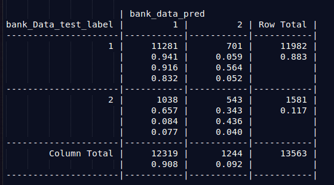
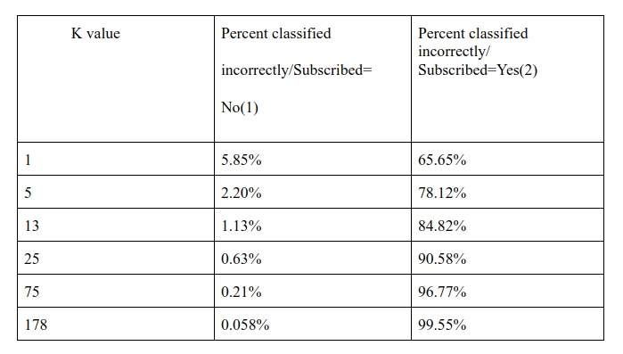
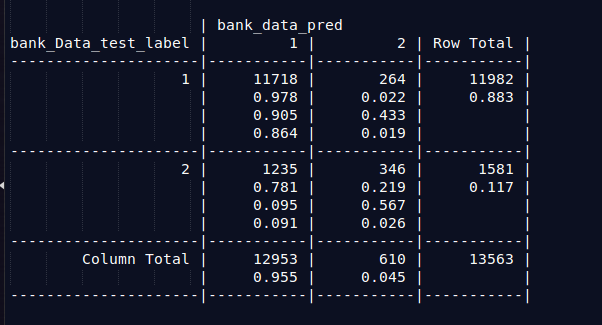
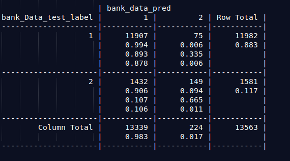
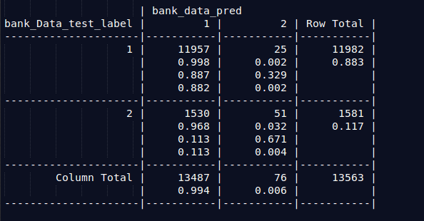
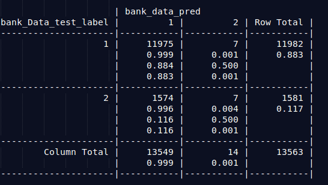

## Marketing-Campaign-Recommendation-System

### Objective:  to determine whether the product is ‘yes’ or ‘no’ subscription.
1.1) Use KNN to analyze the given data set.

The main purpose of this project is to increase campaign efficiency by identifying the main factors that affect the success of a campaign.  Also by predicting whether the campaign will be successful to a certain client, namely, whether the client will subscribe a term deposit. 

Figure 01: Cross table

According to above the cross table, the cell percentages in the table indicate the proportion of values that fall into four categories. The output variable (desired target): - y - has the client subscribed a term deposit? (binary: "yes=0","no=1"). 

If the classifier has high accuracy, the banks can arrange a better management of available resources by focusing on the potential customers “picked” by the classifier, which will improve their efficiency a lot. Also,  the plan is to find out which factors are influential to customers’ decision, so that a more efficient and precise campaign strategy can be designed to help reduce the costs and improve the profits.	

1.2) What is the optimal K? What is the accuracy rate? 

The bottom-right cell indicates the true success results of the campaign.  The 1-NN 52.31% correctly identified success deposit. The cell falling on the top-left to bottom right diagonal contain of examples where the k-NN approach agree with true label and other diagonal contain count of examples where the k-NN approach disagree with the true label. 
Since there is large amount of Data, data preparation is difficult. However if use data visualisation, it will be easy. The boxplots and barplot can use to identify outliers in the data set(See Rplot.pdf). 

According to barplot for credit default, it is  highly skewed towards NO, this shall be removed from further analysis. 
According to k=1;

Table 01: K  values

As k increases, bias increases but variance decreases. To counteract this, 10-fold cross-validation was used. The best k is the one that minimizes the misclassification rate for the
validation data set. The optimum k is in between 170-220. (see R plot.pdf)	

k=5

k=25

k=75

k=178

1.3)  Address any other concerns you might have 
When the program run confusionMatrix, higher computing power  is required. 

### Conclusion 
 
 There are two types of customers; subscribed and unsubscribed. The unsubscribed customers were predicted 99% (error % is 0.058) by k= 178.Therefore, if we can predict the  number of unsubscribed customers correctly using k=178, we can find the subscribed customers and the campaign can invest  and do more focus on them.

### Reference

UCI Machine Learning Repository: Bank Marketing Data Set. (n.d.). Retrieved May 22, 2017, from https://archive.ics.uci.edu/ml/datasets/Bank+Marketing

Lantz, B. (2013). Machine Learning with R. Packt Publishing Ltd.
